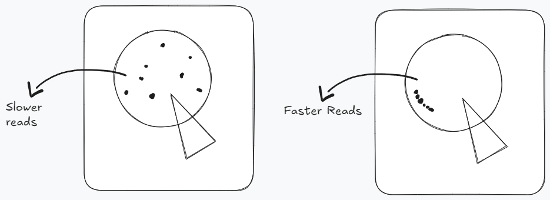
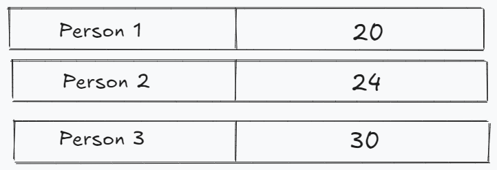
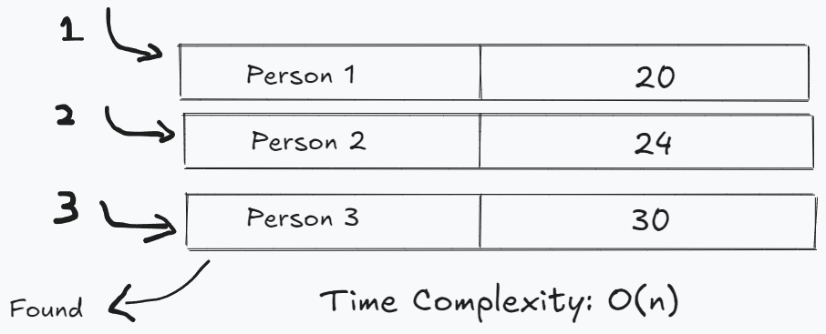
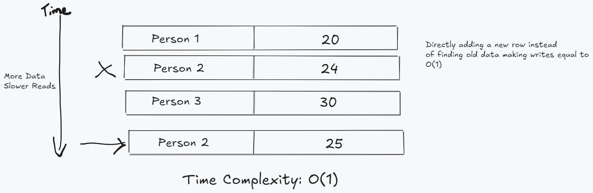

# Diving into Databases
One of the main and the most important part of a system is the database. And every part of the software is dependent on it. could be writing on database or reading from it. But with billion of users performing operations on your system could be chaotic. Slowing your system (Both read and write) a lot slower. So the jest of system designer is design such system which  can uphold petabytes of data. 

#### Reads Vs Writes
Study says that most of the systems with billion of user base make 80% reads and 20% writes surprising isn't it? Yes, the data reads are way more frequent then writes. So our primary goal is handling such amount of reads without ignoring writes also.

This discussion led us to the point where we have to made decision of where to store the data?
### Hard Drives As Databases In Depth:
Hard drive stores data on metal disks and is divided into parts which can be accessed by the address. It also consists of a read/write head (A Pointer) which moves on the disk and reads data from it. 

##### **Reading From Hard drive**
Data on hard drive could be at different addresses so while reading it the pointer needs to move frequently to get the desired information which could be expensive.
- So we need our data to be closer so that our pointer does find the desired data fast. e.g. storing data in array.

Now the next part is finding data? Lets take an example where we have people and their ages

If we want to find the age of person 3 we actually don't know the address of the data where it resides but rather it will go over all the rows and find the desired data.

And in case we want to write the data on some row we still have to find that row and change the data making the time complexity of it equals to O(n) also.

**Side Note Making Write Faster**
If we store new data every time we want to write like appending new data it will give us O(1) write speed but we are compromising or storage and the read speed. Explained in below figure.

This is where we need indexes. We will be diving deep into Indexes in next learning.
Will discuss the following Indexes:
- Hash Index
- B-Tree Index
- LSM and SS Table Index
### **Extras**
Facts about the data could be the following:
##### Persistency
No one wants his work go in vain after the system restarts or malfunction. So, the persistency is the key of a system data. We have to insure that every little part of information of a user persists even after disasters or any other case.

##### Hard Drive
The Persistency part of a system can only be fulfilled if the data is stored on a hard disk. Hard Drives consists of metal disk which stores the data in non sequential order.

##### Database
Data without a proper shape is of no use either so we consider the data should be manageable, in proper form, and understandable. For that, Databases are they best way to ensure these qualities.

### Conclusion
Designing a database system that can handle billions of users while maintaining high read and write performance is crucial for modern systems. The core takeaway is that reads tend to dominate system operations, making up about 80% of the workload, while writes comprise 20%. This imbalance highlights the need for efficient read handling without neglecting write performance.

Hard drives, as the foundation for data storage, present challenges due to their mechanical nature. The read/write head must move to different locations on the disk to access data, making non-sequential data retrieval slower.

Persistency is also a key aspect of database systems. Ensuring data remains intact after system failures or restarts is crucial, and hard drives fulfill this requirement by storing data long-term. 